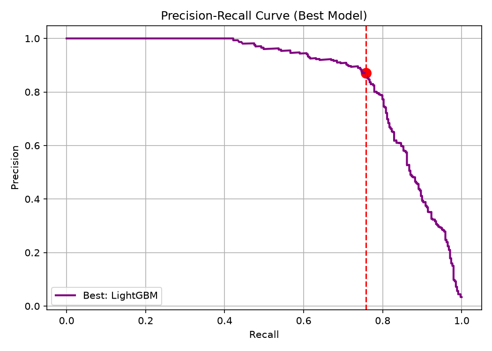
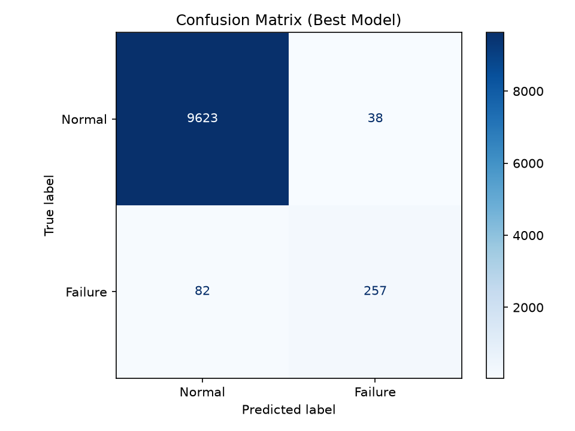

# Predictive Maintenance System & Explainable AI (XAI) Engine

This repository contains an end-to-end Machine Learning and REST API system designed to monitor industrial machine telemetry, predict imminent mechanical failures, and provide transparent explanations for predictions using Explainable AI (SHAP).

## 🚀 Key Highlights

* **Multi-Model Shootout:** We rigorously evaluated four distinct machine learning architectures: **LightGBM, XGBoost, Random Forest, and a Multi-Layer Perceptron (MLP)**.
* **Domain-Driven Feature Engineering:** Includes physical derived features: `Power = Torque * Rotational Speed` and `Temp Difference = Process Temp - Air Temp` to guide decision boundaries.
* **Precision Optimization:** Uses precision-recall threshold tuning to maximize the **F1-Score** and minimize expensive false alarms.
* **Explainable AI (XAI):** Employs **SHAP** (TreeExplainer & KernelExplainer) on the backend for near-instantaneous feature contribution analysis, dynamically adapting to the architecture of the winning model.
* **MLflow Tracking:** The entire training lifecycle (hyperparameters, metrics, and PR/ROC curves) is strictly logged to an MLflow experiment registry.
* **Production-Grade API & Dashboard:** Includes a FastAPI backend serving a lightweight, interactive HTML/CSS dark-mode telemetry diagnostic dashboard.

---

## 🧠 Machine Learning Models

The core of this project relies on a comprehensive comparison of different algorithmic approaches on the highly imbalanced AI4I 2020 Predictive Maintenance Dataset. 

### 1. LightGBM (Gradient Boosting) 🏆 *Winning Model*
LightGBM won the overall shootout. Its leaf-wise tree growth strategy allowed it to capture complex non-linear sensor relationships incredibly fast while remaining highly robust to the class imbalance. 

### 2. Random Forest
An ensemble of decision trees used as our primary baseline. It achieved excellent accuracy but suffered slightly in finding the optimal precision-recall balance compared to the gradient boosting techniques.

### 3. XGBoost
XGBoost utilized a custom `scale_pos_weight` parameter to aggressively penalize false negatives (missed failures). It performed exceptionally well but was marginally edged out by LightGBM in the final F1-score.

### 4. Multi-Layer Perceptron (Neural Network)
A dense, feed-forward neural network (MLP) was trained to test if deep learning architectures could natively pick up on complex telemetry interactions better than tree-based models. While performant, it fell slightly behind the gradient boosting models on this specific tabular dataset.

---

## 📊 Comprehensive Model Evaluation

All models were evaluated using **5-Fold Stratified Cross-Validation**. Because predictive maintenance datasets are highly imbalanced (failures are rare), we optimized our decision thresholds using **F1-Score** and **PR-AUC** rather than raw accuracy.

### Final Shootout Metrics

| Model | Accuracy | F1-Score | Precision | Recall | PR-AUC | ROC-AUC |
| :--- | :---: | :---: | :---: | :---: | :---: | :---: |
| **LightGBM 🏆** | **98.80%** | **0.8107** | **87.12%** | **75.81%** | **0.8549** | **0.9777** |
| Random Forest | 98.77% | 0.8069 | 86.24% | 75.81% | 0.8556 | 0.9722 |
| XGBoost | 98.68% | 0.7911 | 85.32% | 73.75% | 0.8337 | 0.9785 |
| MLP (Neural Net)| 98.13% | 0.7302 | 71.47% | 74.63% | 0.7842 | 0.9735 |

> *Note: All training runs, parameters, and these metrics are automatically tracked and logged to the local `mlruns` directory via MLflow.*

### 📈 Model Evaluation Visualizations (LightGBM)

| Precision-Recall Curve & Threshold Tuning | Confusion Matrix |
| :---: | :---: |
|  |  |

---

## 🛠️ Project Architecture

```
                 +---------------------------+
                 |   data/rui-dataset.csv    |
                 +-------------+-------------+
                               | (src/eda_analyzer.py)
                               v
                 +---------------------------+
                 | rui-dataset-engineered.csv|
                 +-------------+-------------+
                               |
                               v
                 +---------------------------+
                 |  src/train_advanced.py    | <--- MLflow Tracking
                 +-------+-----------+-------+
                         |           |
                         v           v
             +---------------+   +-----------+
             |models/model.pkl|  | eda plots |
             +-------+-------+   +-----------+
                     |
                     v
                 +---------------------------+
                 |       app.py (FastAPI)    | <--- Client / Dashboard Request
                 +-----------+-----------+---+
                             |
                             v
              +-----------------------------+
              | - Failure Probability       |
              | - SHAP Feature Contribution |
              | - Troubleshooting Guidance  |
              +-----------------------------+
```

---

## 📋 Telemetry & Engineered Features

The system monitors 5 core sensor parameters:
1. **Air temperature [K]**
2. **Process temperature [K]**
3. **Rotational speed [rpm]**
4. **Torque [Nm]**
5. **Tool wear [min]**

Additionally, 2 physics-derived features are engineered:
6. **Power_Nm_RPM** (`Torque * Rotational Speed` - workload index)
7. **Temp_Difference_K** (`Process temperature - Air temperature` - thermal efficiency)

---

## ⚙️ Installation & Usage

### 1. Setup Environment
Clone the repository, create a virtual environment, and install dependencies:
```powershell
git clone https://github.com/Mansi091/RetrievalLab.git
cd RetrievalLab
python -m venv venv_win
venv_win\Scripts\activate
pip install -r requirements.txt
```

### 2. Exploratory Data Analysis & Feature Engineering
Generate EDA trends and correlation heatmap plots:
```powershell
python src/eda_analyzer.py
```
Plots will be saved inside the `static/eda` folder.

### 3. Model Training & MLflow Tracking
To train all 4 classifiers (LightGBM, XGBoost, Random Forest, MLP), track them in MLflow, and save the winning model:
```powershell
python src/train_advanced.py
```
You can view the MLflow UI by running: `mlflow ui`

### 4. Running the REST API & Dashboard
Start the FastAPI server:
```powershell
python -m uvicorn app:app --reload
```
* Access the interactive Dashboard at: **`http://127.0.0.1:8000/`**
